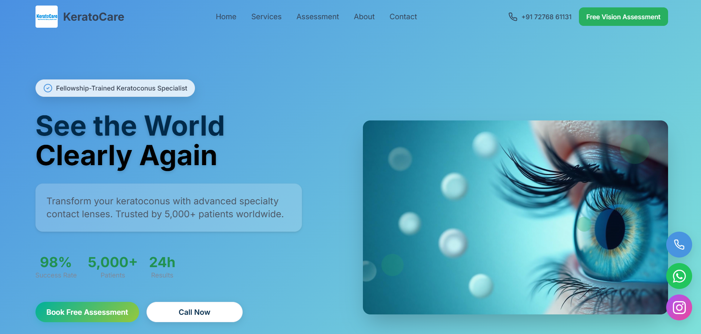

# Kerato Care9

A Vite + React + TypeScript starter app scaffolded with shadcn-ui and Tailwind CSS. This repository contains the Kerato Care9 frontend application. The project includes a basic routing structure, UI primitives, and several useful third-party libraries for building forms, charts, notifications, and animations.

Deployed link

- Live preview / deployment: https://lovable.dev/projects/f4253598-bcc8-4533-815c-ca88d6aa86ee

Screenshots

Add screenshots of the app here (replace the placeholders with real images):

- Desktop view: 
- Mobile view: 

Project structure (key files)

- src/
  - main.tsx — app entry
  - App.tsx — router and global providers (React Query, tooltips, toasters)
  - index.css / App.css — styling and Tailwind setup
  - pages/ — app pages (Index, Admin, NotFound)
  - components/ — UI components (shadcn + Radix primitives)

Technologies

- Vite
- React 18
- TypeScript
- Tailwind CSS
- shadcn-ui (Radix + Tailwind UI primitives)
- React Router
- @tanstack/react-query
- Sonner and Radix toasts
- Recharts (charts)
- react-hook-form + zod (forms & validation)

Features

(Notes: the codebase is currently a scaffold. The features below reflect the libraries and routes present in the project and the intended functionality to be implemented.)

- Routing
  - / — Public landing page (Index)
  - /admin — Admin dashboard (Admin)
  - Catch-all — 404 / NotFound
- Global state & data fetching
  - React Query configured for server state caching and fetching
- Notifications
  - Toaster and Sonner notifications are set up globally
- UI primitives
  - shadcn-ui + Radix primitives for accessible components (tooltips, dialogs, popovers, etc.)
- Forms & validation
  - react-hook-form + zod for building forms with schema validation
- Charts & data visualization
  - Recharts is included for displaying charts and analytics
- Date handling
  - date-fns and react-day-picker for date utilities and pickers
- Carousel & media
  - embla-carousel-react for performant carousels
- OTP input, progress, sliders and other UI widgets
  - input-otp, Radix components for advanced controls
- Theme support
  - next-themes for light/dark theme toggling

Getting started (local development)

1. Clone the repo

   git clone https://github.com/pb1803/kerato_care9.git
   cd kerato_care9

2. Install dependencies

   npm install

3. Run the dev server

   npm run dev

4. Build for production

   npm run build

5. Preview the production build locally

   npm run preview

Available scripts

- npm run dev — start Vite dev server
- npm run build — build production bundle
- npm run build:dev — build with development mode
- npm run lint — run ESLint
- npm run preview — preview production build

Notes & next steps

- The repository currently contains a scaffolded UI and router. Implement page content inside src/pages (Index, Admin, NotFound) and add components under src/components.
- Add real screenshots to the ./screenshots directory and update the image links above.
- If you deploy elsewhere (Vercel, Netlify, Fly, etc.), update the "Deployed link" section with the official URL.

Contributing

Contributions are welcome. Please open issues or pull requests for changes.

License

- Add a LICENSE file to specify the project's license. If none is provided, assume "All rights reserved".

Contact

- Repository owner: @pb1803

-----

Replace the existing README.md entirely with the content above. Commit message: "chore: replace README with project-specific documentation"
